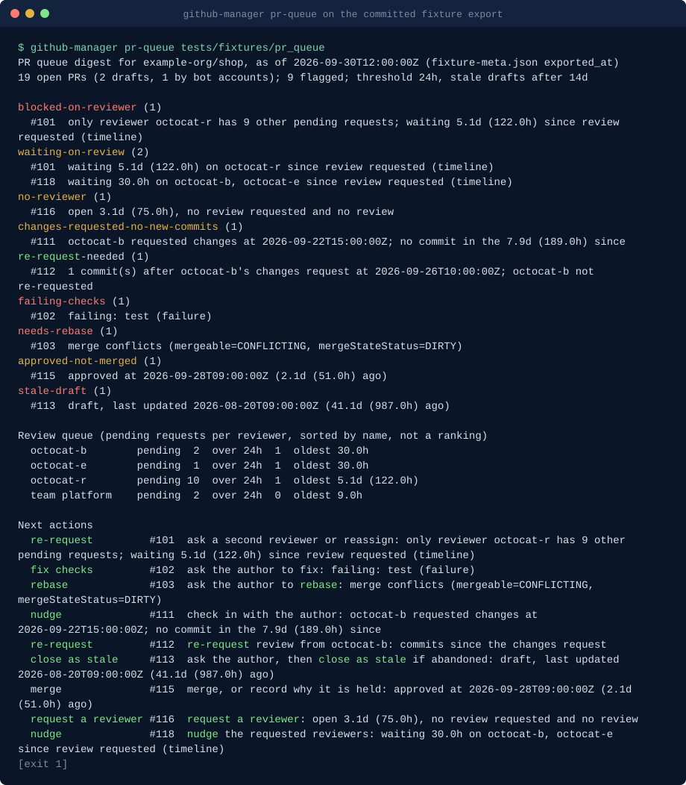

# github-manager-skills: Claude Code skills for engineering managers

**Engineering manager skills for Claude Code that compute from exported GitHub data: a stuck-PR and review-queue digest, an iteration report, an incident postmortem timeline and an issue triage digest, every number cited to the PR or issue it came from.**

github-manager-skills is a Claude Code plugin with four skills for engineering managers and tech leads who report on work that lives in GitHub. It exists because manager artefacts (the standup digest, the sprint report, the postmortem timeline) are usually written from memory, and memory miscounts: a PR merged the day after the sprint gets included, the mitigation lands before the label, the reviewer with ten pending requests goes unnoticed. Each skill reads a saved `gh` export with a standard-library Python script, computes the figures with stated definitions, and cites every row, so the text Claude writes can be checked by clicking the links.

Common searches it answers: stale PRs and review bottlenecks, cycle time to merge and review turnaround (the DORA metrics' lead time for changes up to the merge, not the other three), a cited incident postmortem timeline, and issue triage (unlabelled, unanswered, duplicate and stale issues, label suggestions).

Find this when you search for: issue triage, stale issues, duplicate issues, issue backlog cleanup, label suggestions.

```text
/plugin marketplace add basitalisandhu/github-manager-skills
/plugin install github-manager@github-manager-skills
```

Quickstart: open Claude Code and ask "which PRs are stuck on OWNER/REPO?"; the skill gives you the `gh` export commands to run, then reads the files. Or run a script directly from a clone of this repository on the committed fixture:

```bash
python3 scripts/cli.py pr-queue tests/fixtures/pr_queue
```

Questions, bugs and ideas: open an issue on this repository. Security reports: see [SECURITY.md](SECURITY.md).

## Demo



Generated from the committed fixtures by [`scripts/render_demo.py`](scripts/render_demo.py); run `python3 scripts/render_demo.py` to regenerate it. The fixture is synthetic, with example handles such as `octocat-a`.

## When to use this

- Which PRs are stuck, and what is the one next step for each (nudge, re-request, rebase, fix checks, merge, close as stale)? `pr-queue-digest`
- Is one reviewer holding up the queue? Answered as a count of pending requests, not a score: `pr-queue-digest`
- What did we ship this iteration, what carried over, and what are our cycle time and review turnaround, with the PRs behind each number? `iteration-report`
- Build the timeline for an incident review, with detected, acknowledged, mitigated and resolved taken from what the issue recorded: `incident-postmortem-timeline`
- Which issues need triage: unlabelled, unanswered, probable duplicates, stale, most thumbs-up, with a suggested label each: `issue-triage-digest`

## Skills

| Skill | Triggers on | Script | What it produces |
|---|---|---|---|
| `pr-queue-digest` | "which PRs are stuck?", "PR digest for standup", "what is waiting on review?", "which drafts can we close?" | `pr_queue.py` | PRs waiting on review longer than N hours, PRs blocked on one requested reviewer with a long queue, changes requested with no new commits, commits with no re-request, failing checks, conflicts, approved but unmerged, no reviewer, stale drafts; a review-queue table per reviewer (counts only); one next action per PR, each citing the PR |
| `iteration-report` | "write the sprint report", "what did we ship?", "what carried over?", "what is our cycle time?" | `iteration_report.py` | shipped PRs with the issues they close, carried over, completed, not planned, newly opened, PRs merged outside the window (listed, not counted), cycle time median and p90 (from first commit or PR creation, stated), review turnaround median; team level only |
| `incident-postmortem-timeline` | "write the postmortem for #412", "build the incident timeline", "how long did it take to mitigate?" | `postmortem.py` | a timeline of label changes, assignments, comments, linked PR merges and closes, each citing its event id, comment id or PR; phases derived by stated rules, with disagreeing signals reported; people as roles; contributing factors as questions; a postmortem skeleton |
| `issue-triage-digest` | "which issues need triage?", "what has nobody answered?", "any duplicate issues?", "prepare the triage meeting" | `issue_triage.py` | unlabelled issues, issues with no reply from anyone but the author for N days, possible duplicates by title word overlap, stale issues, issues with many thumbs-up, and a suggested label per issue from a YAML keyword map; counts per check and per label; Markdown and JSON |

Every script reads files only, prints Markdown or text by default and JSON with `--json`, takes `--redact` to replace logins with stable tokens or roles, and exits 2 on bad input. `pr_queue.py` exits 1 when it flags a PR, so it can gate a scheduled job.

## How the data gets in

The skills never call GitHub themselves. Each `SKILL.md` lists the exact read-only commands to run first, for example:

```bash
gh pr list --repo OWNER/REPO --state open --limit 500 \
  --json number,title,url,author,isDraft,createdAt,updatedAt,reviewDecision,reviewRequests,reviews,commits,statusCheckRollup,mergeable,mergeStateStatus \
  > prs.json
```

plus `gh api repos/OWNER/REPO/issues/N/timeline --paginate --slurp` for review request times and incident timelines, `gh issue list --json ...` for iteration scope and issue triage, and `gh pr view N --json ...` for the PRs an incident references. Each skill states the minimal token scopes: read-only Metadata, Pull requests and Issues on a fine-grained token (Checks and Commit statuses for the check columns), or the default `gh auth login` token. The saved folder is the audit trail: re-running a script on it gives the same numbers.

## What this is not

- **Not a surveillance tool.** Nothing here watches people, runs in the background, or collects data on its own. You export a snapshot of PRs or issues, and a script summarises it once.
- **No per-person productivity scoring.** There are no leaderboards, no per-engineer throughput, no "slowest reviewer". The PR digest counts the review queue per reviewer so a lead can rebalance it; the iteration report has no author columns at all; the postmortem lists people as roles. The skills tell Claude to decline requests to rank individuals and to explain why: PR counts miss pairing, reviewing, incident work, mentoring and design, so a ranking built from them is wrong as well as harmful.
- **Not a dashboard or a hosted service.** No server, no database, no tokens stored, no seats.
- **Not a root-cause tool.** The postmortem timeline turns contributing factors into questions for the review; it never states a cause.

## How this differs from what you may already have

- **Anthropic's knowledge-work plugins** include `standup`, `status-report`, `sprint-planning` and `incident-response`. Those are conversational templates: they format what you tell them or what a connector returns. This pack computes: waits from review request events, cycle time with a stated start and a nearest-rank p90, phases from label and merge times, and every figure carries the PR or issue numbers it counts. Use the templates for tone and structure, and these skills for the numbers.
- **Paid PR analytics dashboards** compute similar metrics continuously across an organisation. This pack is a point-in-time report from files you saved, with no account and nothing to install beyond Python.
- **Reminder Actions** post a list of waiting PRs to chat. `pr-queue-digest` also says why each PR is stuck and what single action would unstick it, and shows when the wait is really one reviewer's queue.

## Install

The plugin installs as shown at the top. The scripts are also available without Claude Code:

- **Container image** (GitHub Packages, linux/amd64 and linux/arm64), entrypoint `github-manager <subcommand> [args]`; mount the export folder at `/work`:

  ```bash
  docker run --rm -v "$PWD:/work" ghcr.io/basitalisandhu/github-manager-skills:0.2.0 pr-queue /work/export --markdown
  docker run --rm -v "$PWD:/work" ghcr.io/basitalisandhu/github-manager-skills:0.2.0 postmortem /work/export --issue 412 --redact
  ```

  The image is published when a version tag is pushed, signed with cosign (keyless), with a build provenance attestation and an SPDX SBOM attached to the GitHub Release.

- **Python package** `github-manager-skills`, which installs the same `github-manager` command. PyPI publishing is set up in `release.yml` but switched off until the trusted publisher is configured, so until then install from a clone: `pip install .`

| Subcommand | Script (skill) |
|---|---|
| `pr-queue` | `pr_queue.py` (pr-queue-digest) |
| `iteration-report` | `iteration_report.py` (iteration-report) |
| `postmortem` | `postmortem.py` (incident-postmortem-timeline) |
| `issue-triage` | `issue_triage.py` (issue-triage-digest) |

From a checkout, `python3 scripts/cli.py` is the same dispatcher.

This pack is also part of [claude-skills](https://github.com/basitalisandhu/claude-skills), which holds every skill I maintain as one marketplace: `/plugin marketplace add basitalisandhu/claude-skills`.

## Security posture

- **Read-only, offline scripts.** The skill scripts read the folder you name and print to standard output. They import no network module (the repository validator checks this), call no subprocess, and write files only where you pass `--out` (`issue_triage.py`).
- **Exports are yours.** The `gh` commands in each skill only read. Keep export folders out of version control; `.gitignore` already ignores `export/` and `gh-export/`.
- **Untrusted content.** PR titles, issue bodies and comments are data, never instructions: each `SKILL.md` says so.
- **Redaction.** `--redact` replaces every login the export contains (and `@mentions` of them in text) with a stable `user-xxxxxx` token, or with a role in the postmortem.

## What is inside

```text
.claude-plugin/marketplace.json                       marketplace manifest
plugins/github-manager/
├── .claude-plugin/plugin.json                        plugin manifest
├── README.md                                         the plugin's skill table
└── skills/<name>/
    ├── SKILL.md                                      triggers, export commands and scopes, principles, procedure, limits
    └── scripts/<script>.py, _ghexport.py             standard library only, --help, --json, --redact
scripts/cli.py                                        the github-manager dispatcher (container and package entrypoint)
scripts/validate_plugin.py                            structure, frontmatter, scripts, READMEs, house style
scripts/render_demo.py                                regenerates docs/demo.svg from the fixtures
tests/                                                pytest suite, offline; fixtures/ holds saved exports with planted cases
```

## Development

```bash
python3 -m pytest -q
ruff check .
python3 scripts/validate_plugin.py
claude plugin validate --strict . && claude plugin validate --strict plugins/github-manager
```

See [CONTRIBUTING.md](CONTRIBUTING.md) for the ground rules and [docs/good-first-issues.md](docs/good-first-issues.md) for a place to start.

## Frequently asked questions

**Are there Claude Code skills for engineering managers that work from GitHub data?**
Yes, this plugin: `pr-queue-digest`, `iteration-report`, `incident-postmortem-timeline` and `issue-triage-digest`. Each reads a saved `gh` export with a tested script and cites every number to the PR or issue it came from.

**Does it call the GitHub API or need a token?**
The scripts do not; they read JSON files. You run the `gh` export commands listed in each skill, with your own `gh` login and read-only access.

**Can it rank engineers or measure individual productivity?**
No, by design. The review queue is a count per reviewer for rebalancing, the iteration report is team level, and the postmortem uses roles. See "What this is not".

**How is cycle time defined?**
From the first commit (or, with `--cycle-start pr-open`, from PR creation) to merge, for PRs merged in the window. The report gives the median (the mean of the two middle values when the count is even) and p90 by nearest rank, says which start was used, and lists the PRs counted.

**Why does the postmortem say "mitigated" earlier than our label?**
Because the mitigation PR merged first. The script takes the earliest recorded signal for each phase, lists the others, and turns the gap into a question for the review ("what confirmed that the mitigation worked?").

**Can I run it on a schedule?**
Yes, without Claude Code: export with `gh`, then run `github-manager pr-queue <folder> --markdown`. It exits 1 when something is flagged.

## Related projects

| Project | What it is |
|---|---|
| [repo-engineering-skills](https://github.com/basitalisandhu/repo-engineering-skills) | Claude Code skills for repository audits and documentation, including release notes checked against commits |
| [claude-dev-skills](https://github.com/basitalisandhu/claude-dev-skills) | Claude Code skills for everyday development: code review, refactoring, debugging, CI and containers, docs and security basics |
| [cc-hooks](https://github.com/basitalisandhu/cc-hooks) | Typed Python SDK and offline test runner for Claude Code hooks |
| [Get this and the other packs with one clone](https://github.com/basitalisandhu/claude-skills) | All packs in one repository; this plugin's pages are at https://basitalisandhu.github.io/claude-skills/plugins/github-manager/ |

More from the author: [github.com/basitalisandhu](https://github.com/basitalisandhu).

## Licence

MIT. See [LICENSE](LICENSE).
